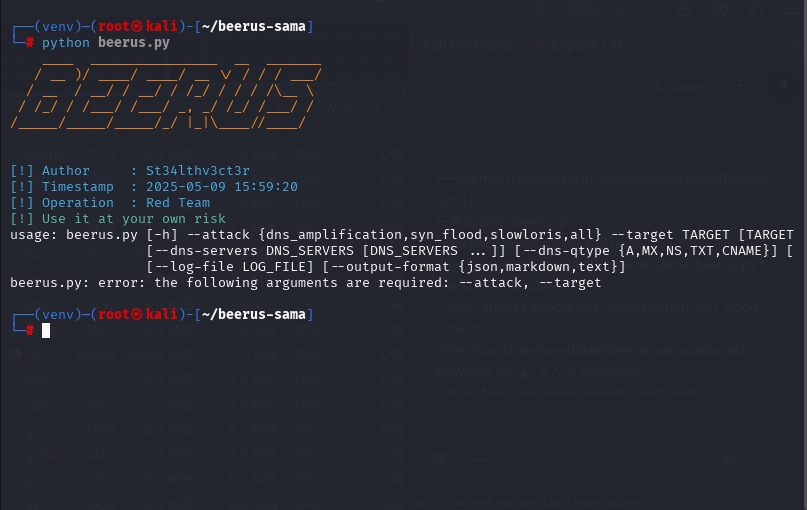

---

# BEERUS  🐉

**Author**: St34lthv3ct3r
**Operation**: Red Team

---

## What is BEERUS?

BEERUS is a Python tool that launches DoS attacks for Red Team testing.

---

## Supported attack vectors

* `dns_amplification`: DNS-based reflection attacks
* `syn_flood`: TCP SYN packet flooding
* `slowloris`: Exhausts HTTP connections
* `all`: Launches all the above together

---

## Setup (Required Once)

1. **Install Python 3.12.9**
   Make sure you're using Python 3.12.9 for compatibility.

   ```bash
   sudo apt update
   sudo apt install python3.12 python3.12-venv python3.12-dev -y
   ```

2. **Clone the repo**

   ```bash
   git clone https://github.com/calebpentest/beerus-sama
   cd beerus-sama
   ```

3. **Install dependencies**

   ```bash
   pip install -r requirements.txt
   ```

---

## Usage

```bash
python beerus.py --attack [vector] --target [IP/host] --confirm-consent
```

### Example:

```bash
python beerus.py --attack syn_flood --target 192.168.1.10 --duration 60 --rate 1000 --confirm-consent
```

---

## Optional Parameters

| Flag              | Description                         | Default         |
| ----------------- | ----------------------------------- | --------------- |
| `--duration`      | Duration of attack in seconds       | 60              |
| `--rate`          | Max packets/requests per second     | 500             |
| `--port`          | TCP port (SYN/Slowloris)            | 80              |
| `--dns-servers`   | DNS resolvers to use                | 8.8.8.8 1.1.1.1 |
| `--dns-qtype`     | DNS query type for amplification    | A               |
| `--proxies`       | HTTP proxies for Slowloris          | None            |
| `--log-file`      | Path to save logs                   | None            |
| `--output-format` | Output format: text, json, markdown | text            |

---

